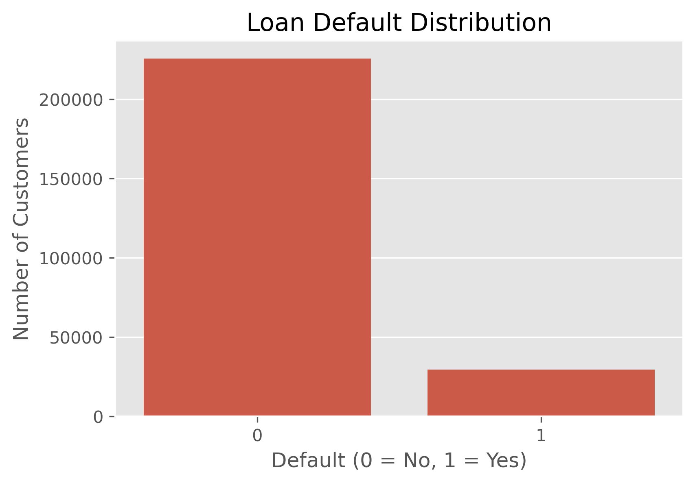
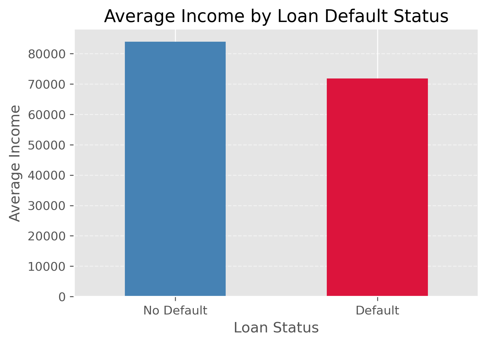
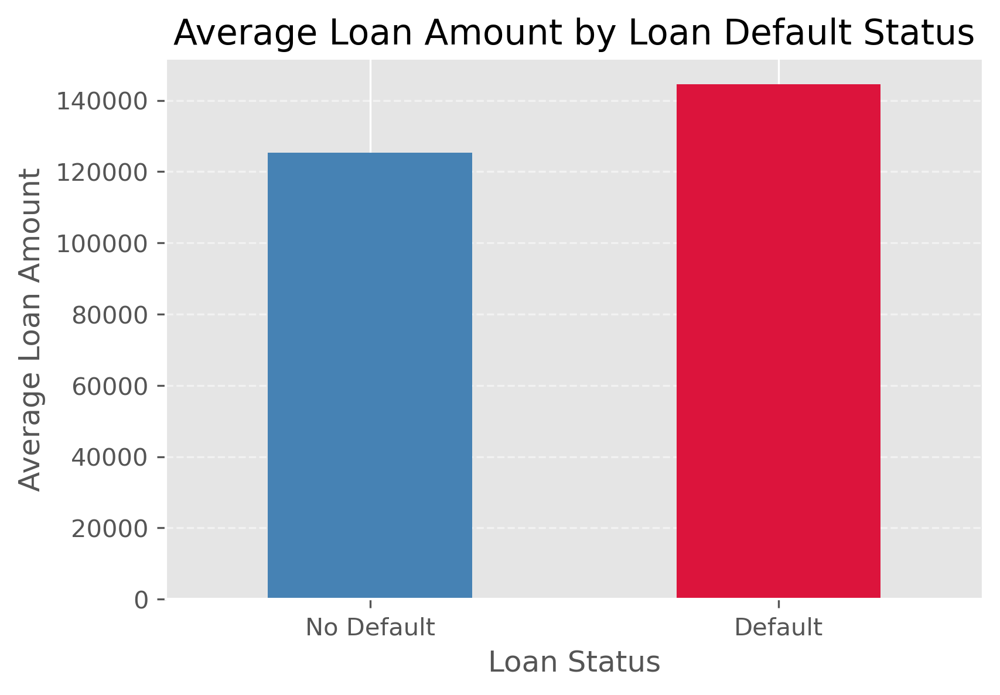
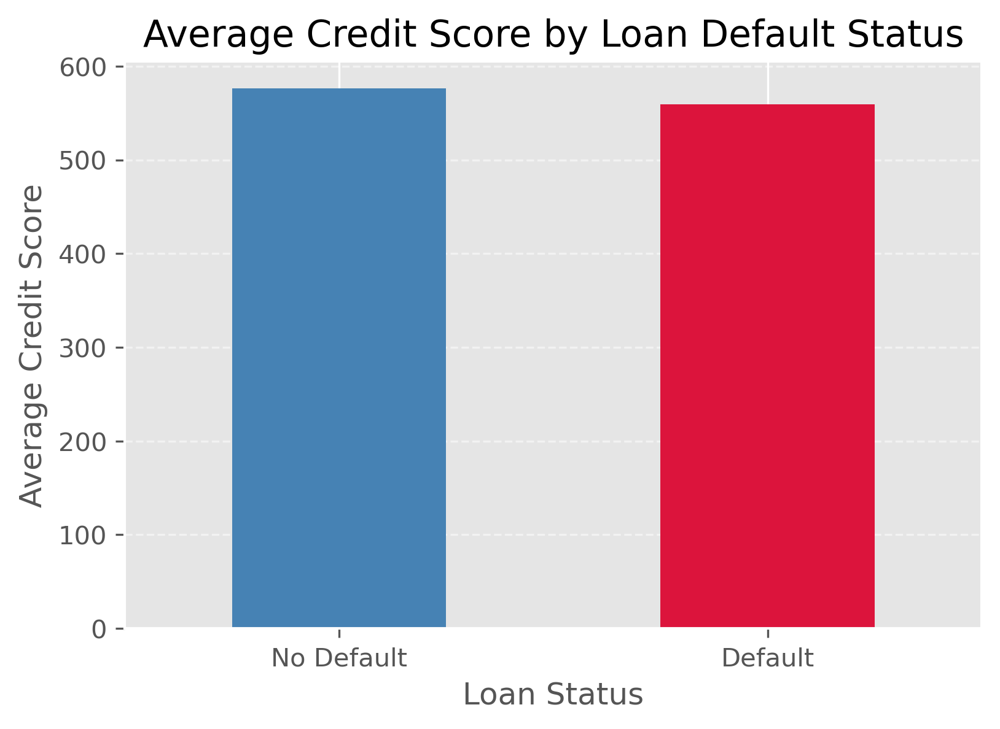
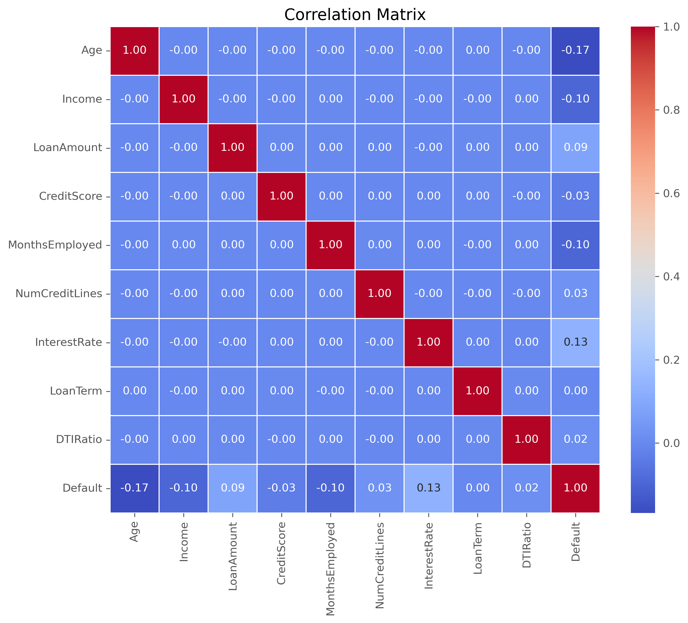
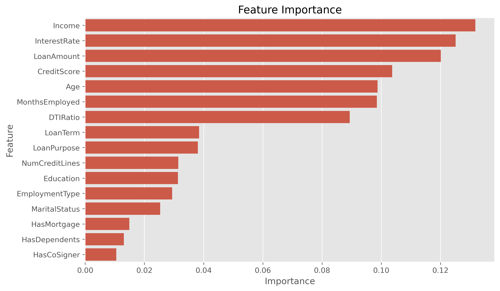

# 🏦 Bank Loan Risk Analysis

## 📌 Project Overview

This project analyzes customer loan data to identify the key factors influencing loan default. Using Python, Exploratory Data Analysis (EDA), statistical analysis, and a Random Forest machine learning model, this project uncovers patterns that can help financial institutions improve credit risk assessment and lending decisions.

---

## 🎯 Business Problem

Loan defaults result in significant financial losses for banks and lending institutions. The objective of this project is to analyze customer characteristics, identify major factors associated with loan default, and provide actionable business recommendations using data-driven insights.

---

## 📂 Dataset Overview

- **Total Records:** 255,347
- **Total Features:** 18
- **Target Variable:** Default
- **Default Rate:** 11.61%
- **Non-Default Rate:** 88.39%

---

## 🛠️ Tools & Technologies

- Python
- Pandas
- NumPy
- Matplotlib
- Seaborn
- Scikit-learn
- Jupyter Notebook

---

## 📊 Project Workflow

- Data Loading & Exploration
- Data Cleaning & Validation
- Exploratory Data Analysis (EDA)
- Univariate & Bivariate Analysis
- Correlation Analysis
- Feature Importance Analysis
- Random Forest Model Development
- Business Insights Generation
- Business Recommendations

---

# 📈 Exploratory Data Analysis & Insights

## Loan Default Distribution

The dataset contains more non-default customers compared to default customers.

- Non-default customers: **88.39%**
- Default customers: **11.61%**



---

## 💰 Income Analysis

Income was analyzed to understand its relationship with loan repayment behavior. Customers with lower income levels showed a higher probability of default.



---

## 💳 Loan Amount Analysis

Loan amount plays an important role in credit risk assessment. Customers with larger loan amounts showed increased default probability.



---

## 📊 Credit Score Analysis

Credit score was analyzed to understand its impact on customer default behavior. Although it showed limited linear correlation, it remained an important predictive feature in the machine learning model.



---

## 🔗 Correlation Analysis

Correlation analysis was performed to identify relationships between numerical features and understand feature interactions.



---

# 🤖 Machine Learning Model

## Random Forest Classifier

A Random Forest Classifier was used to identify the most influential factors contributing to loan default prediction.

### Top Important Features:

1. Income
2. Interest Rate
3. Loan Amount
4. Credit Score
5. Age
6. Months Employed



---

# 🔍 Key Findings

- 💰 Income was one of the strongest predictors of loan default.
- 💳 Higher loan amounts were associated with increased default risk.
- 📉 Higher interest rates showed a relationship with higher default probability.
- 💼 Longer employment history reduced default risk.
- 📊 Credit Score contributed significantly to model prediction.
- 👨‍👩‍👧 Mortgage status, dependents, and co-signer information had lower predictive importance.

---

# 💼 Business Recommendations

- Prioritize customer income evaluation during loan approval.
- Apply additional risk checks for customers requesting larger loan amounts.
- Closely monitor customers with higher interest rates.
- Consider employment stability as an important lending factor.
- Use machine learning models along with traditional credit scoring methods to improve risk assessment.

---

# 📁 Repository Structure

```text
Bank-Loan-Risk-Analysis/
│
├── Data/
│   └── Loan_default.csv
│
├── images/
│   ├── default_distribution.png
│   ├── income_analysis.png
│   ├── loan_amount_analysis.png
│   ├── credit_score_analysis.png
│   ├── correlation_matrix.png
│   └── feature_importance.png
│
├── Python/
│   └── loan_analysis.ipynb
│
├── README.md
└── requirements.txt

## 👩‍💻 Author

**Prajakta Panchbuddhe**

Aspiring Data Analyst

**Skills:** SQL • Python • Power BI • Excel • Machine Learning

---

⭐ If you found this project interesting, feel free to explore the notebook and connect with me on LinkedIn!
